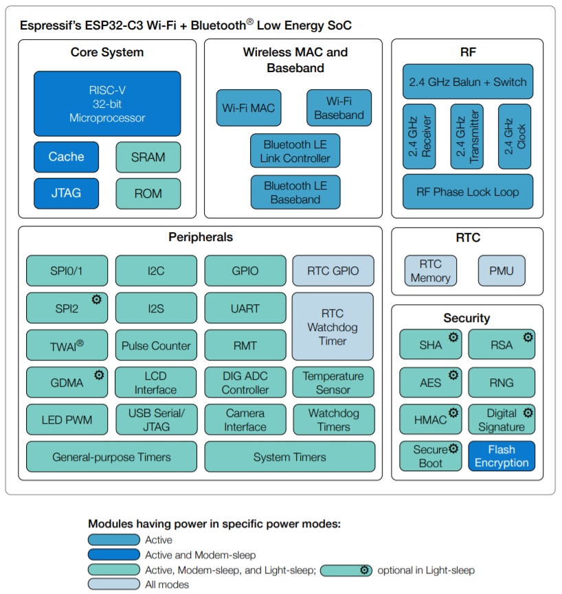

# [ESP32-C3](https://doc.soc.xin/espressif/ESP32-C3)

* [Espressif](https://www.espressif.com/): [RISC-V](https://github.com/SoCXin/RISC-V)
* [L2R2](https://github.com/SoCXin/Level): 160 MHz (2.55 CoreMark/MHz) , [￥6.2 (QFN32)](https://item.szlcsc.com/3013220.html)

## [简介](https://www.espressif.com/sites/default/files/documentation/esp32-c3_datasheet_cn.pdf)

[ESP32-C3](https://www.espressif.com/zh-hans/products/socs/ESP32-C3) 160MHz自研RISC-V单核, 内置 flash 的子型号ESP32-C3F。凭借其生态优势，更多是充当各种协议的载体，适合网络侧应用开发。

### 关键特性

* 160 MHz RISC-V , [407.22 CoreMark](https://www.eembc.org/coremark/scores.php)
* 400KB SRAM (TCM) + 384KB ROM + 4MB SPI Flash
* 2.4 GHz Wi-Fi4 & BLE 5.0
* 2 × UART
* QFN32(5*5)

## [xin资源](https://github.com/SoCXin)

* [参考资源](src/)
* [相关文档](docs/)
* [典型应用](project/)

## [选型建议](https://github.com/SoCXin)

[ESP32-C3](https://github.com/SoCXin/ESP32C3) 的成本对标早期ESP8266，同时沿用乐鑫成熟的物联网开发框架[ESP-IDF](https://github.com/espressif/esp-idf)。

官方提供各种模组型号，ESP32-C3-MINI-1 模组尺寸小巧 (13×16.6 mm)，可支持最高工作温度 105℃。ESP32-C3-WROOM-02 模组支持105℃的最高工作温度，与 ESP-WROOM-02D 和 ESP-WROOM-02 模组引脚兼容，方便用户升级到 ESP32-C3。

升级产品[ESP32-C6](https://github.com/SoCXin/ESP32C6) 主要支持Wi-Fi6(HT20 MCS-9)和更多的协议栈，如和matter、thread共存。

降本方案ESP32-C2由于资源限制无法实现复杂应用，在一定程度上无法发挥积累的协议优势，而简单的控制器应用的可替换方案太多，不太建议使用（门槛较高）。

竞品[BL602](https://github.com/SoCXin/BL602) 拥有更高的主频和更丰富的外设，在MCU应用领域优势突出，但Wi-Fi的通信带宽相对更弱(72.2Mbps)，双方在开源生态构建上，后来者BL602也逐渐被认可，被开发者适配到了各种开源项目中。

### 开源方案

* [PikaPython](https://github.com/OS-Q/PikaPython)

